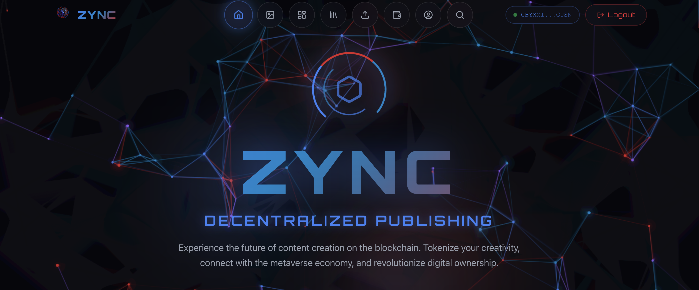
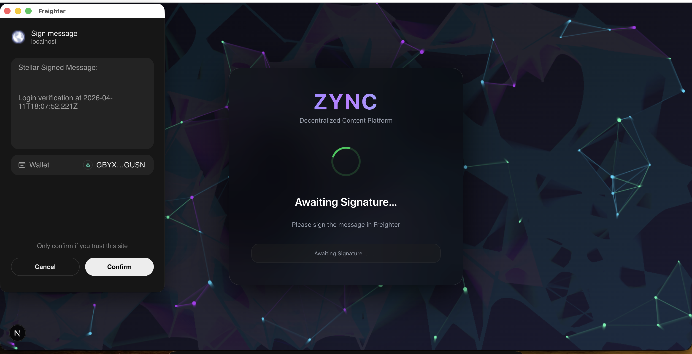
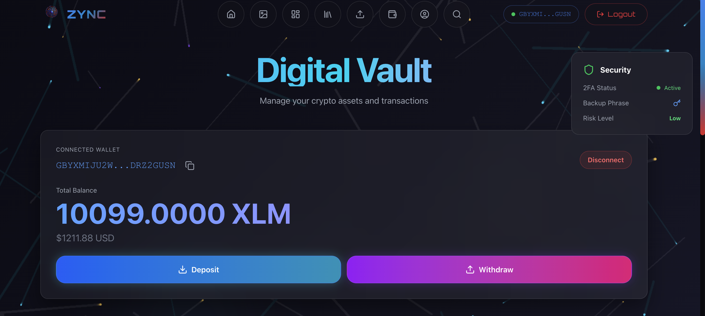
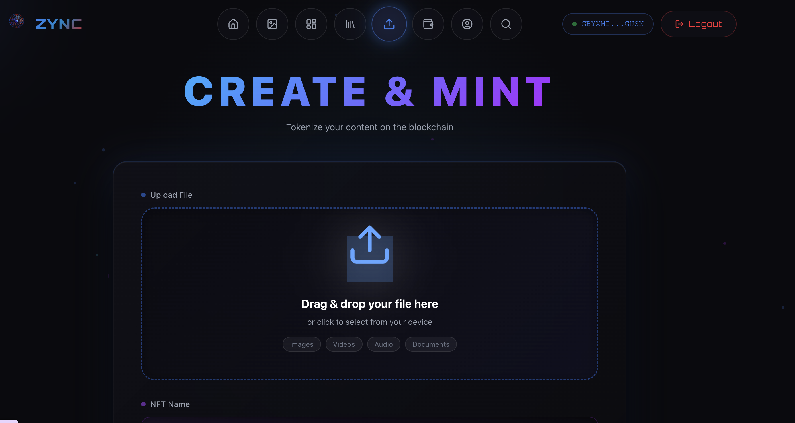

# ZYNC - Decentralized Content Platform (Stellar)

ZYNC is a high-fidelity decentralized content-sharing platform built exclusively for the **Stellar Blockchain** using **Soroban** smart contracts. The platform empowers creators with decentralized ownership, role-based access control, and automated royalty settlements.

## App Interface

### 🌐 Dynamic Homepage
Custom-built editorial interface with deep-layer parallax and glassmorphic navigation.


### 🛰️ Freighter Authentication
Seamless Web3 integration using the official Stellar **Freighter Wallet** for secure identity verification.


### 💰 Wallet & Balance Management
Real-time tracking of native **XLM** balances via the Stellar Horizon API.


### 💎 NFT Content Registration
Direct-to-chain content minting where publishing metadata is permanently anchored to the Soroban network.


---

## 📽️ Video Explanation
Watch the detailed walkthrough and demonstration of the Zync platform on Stellar:
[**Watch on Google Drive**](https://drive.google.com/drive/folders/17dLtEjczj6FqkgJJSdYAzHzNRuH3Avii?usp=sharing)

---

## Technical Features

- **Decentralized Publishing**: Each piece of content is tokenized as a unique Soroban NFT on the Stellar network.
- **Smart Contract Infrastructure**: Logic-driven platform powered by 6 specialized Rust contracts.
- **Automated Royalties**: Transparent secondary sale distributions handled by the `RoyaltyManager` contract.
- **Role-Based Permissions**: Granular ecosystem control (Admin, Creator, Consumer, Moderator) via a native `AccessControl` system.
- **Blazing Fast Performance**: Sub-second finality and minimal gas fees on the Stellar Testnet.

## Level Completion Matrix

This repository now includes complete implementations for all stated learning levels.

### Level 1 - White Belt
- Multi-wallet connect flow with wallet detection and testnet network checks in `frontend/app/auth/page.tsx`.
- Real Horizon testnet XLM balance loading and periodic refresh in `frontend/app/wallet/page.tsx`.
- Testnet wallet funding via Friendbot in `frontend/app/wallet/page.tsx`.
- Real send-XLM transaction flow (build, sign via wallet, submit) in `frontend/app/wallet/page.tsx`.

### Level 2 - Multi-wallet + Contract + Sync
- StellarWalletsKit integration in `frontend/lib/wallet-kit.ts` and `frontend/app/auth/page.tsx`.
- Explicit wallet error handling (`wallet not found`, `rejected`, `insufficient`) in `frontend/lib/errors.ts` and `backend/src/utils/stellarError.ts`.
- Contract deployment and invocation paths for mint, upload-content, and purchase in:
  - `backend/src/utils/mintNFT.ts`
  - `backend/src/web3/uploadContent.ts`
  - `backend/src/web3/buyNFT.ts`
- Transaction lifecycle tracking (`pending/success/fail`) in:
  - `backend/src/services/txTracker.ts`
  - `backend/src/controllers/tx.Controller.ts`
  - `frontend/app/post/[id]/post-detail.tsx`
  - `frontend/app/wallet/page.tsx`
- Real-time event streaming and synchronization using SSE in:
  - `backend/src/routes/tx.Routes.ts`
  - `backend/src/services/eventBus.ts`
  - `frontend/app/wallet/page.tsx`

### Level 3 - E2E quality
- Loading/progress states across auth/upload/profile/purchase/wallet flows.
- Basic caching with TTL for NFT and profile-heavy views in:
  - `frontend/lib/cache.ts`
  - `frontend/app/content/page.tsx`
  - `frontend/app/my-nfts/page.tsx`
  - `frontend/app/post/[id]/post-detail.tsx`
- Added backend tests for critical error classification in `backend/src/__tests__/stellarError.test.ts`.
- This documentation updated with implementation mapping and verification points.

### Level 4 - Production readiness
- Inter-contract call pattern added via `instant_settle_with_royalty` in `contracts/payment_escrow/src/lib.rs`.
- Marketplace purchase endpoint and frontend purchase flow in:
  - `backend/src/routes/nft.Routes.ts`
  - `frontend/app/api/nft/buy/route.ts`
  - `frontend/app/post/[id]/post-detail.tsx`
- Advanced real-time event streaming pipeline via SSE route `backend/src/routes/tx.Routes.ts`.
- CI pipeline added for frontend, backend, and contracts in `.github/workflows/ci.yml`.
- Mobile responsive behavior preserved and extended in updated wallet/post/profile pages.

---

## Technology Stack

- **Blockchain Engine**: Stellar (Soroban)
- **Contract Language**: Rust
- **Interface**: Next.js, TypeScript, Vanilla CSS
- **Infrastructure**: Express.js, Node.js
- **Metadata Vault**: MongoDB
- **Hardware Integration**: Freighter Wallet API

---

## Soroban Smart Contracts

| Contract Component | Deployment Address (Testnet) |
| :--- | :--- |
| **AccessControl** | `CAUXZFU6GH57S5QWSPO7M2I2ZMWWIX7VA4RFXOA6AT6724D5PTKBZ22A` |
| **ContentNFT** | `CA7VIJCB4D3A7LU2UZHIQDKKCREREBHRT6RLFS35NPT3GKCBMV73WBRW` |
| **RoyaltyManager** | `CBUKJDKA2DSQ4HF5IGAQDUJJ7TLDU3C44ZNA3D7T2IKEFG77T7XMNITS` |
| **PaymentEscrow** | `CC565PKCVD7OODIUP37R3UWRSDVYVPTWAIDKF22D3GNF6WCIYTT4VCGY` |
| **SubscriptionManager** | `CAPJ45XLMHCS75XDYCYJRGTVCXGFZM5FIGP2EBNV7A3C6WTL7COC5HC5` |
| **ContentRegistry** | `CBODPDB5DDR624WR5AFY4ISLYBI5CE3ENFZRZTDAP4FC5M4O6VRX5XKX` |
| **RoyaltyManager** | `CBUKJDKA2DSQ4HF5IGAQDUJJ7TLDU3C44ZNA3D7T2IKEFG77T7XMNITS` |
| **PaymentEscrow** | `CC565PKCVD7OODIUP37R3UWRSDVYVPTWAIDKF22D3GNF6WCIYTT4VCGY` |
| **SubscriptionManager** | `CAPJ45XLMHCS75XDYCYJRGTVCXGFZM5FIGP2EBNV7A3C6WTL7COC5HC5` |

---

## 🔗 Deployment Verification (Stellar Testnet)

All core logic and contract deployments can be verified on the **Stellar Expert** explorer:

| Contract | Deployment Transaction Hash | Explorer Link |
| :--- | :--- | :--- |
| **AccessControl** | `613ce04f66fe55baa26a1e01a62482f9097fefa11744eca61ce75a72ec440aec` | [Check TX](https://stellar.expert/explorer/testnet/tx/613ce04f66fe55baa26a1e01a62482f9097fefa11744eca61ce75a72ec440aec) |
| **ContentNFT** | `fbed31b73a19bf82f7cc3a55d5d6acb85b2c82a3751728cc7b460ad9c8301061` | [Check TX](https://stellar.expert/explorer/testnet/tx/fbed31b73a19bf82f7cc3a55d5d6acb85b2c82a3751728cc7b460ad9c8301061) |
| **ContentRegistry** | `5afb51098967c84459a5d3cd47798596292983d46a314cc54d9f33af087d2d7c` | [Check TX](https://stellar.expert/explorer/testnet/tx/5afb51098967c84459a5d3cd47798596292983d46a314cc54d9f33af087d2d7c) |
| **RoyaltyManager** | `383a3e46ff068df29397fc25115d86f768fb8f3819af5a0898f4e9918cebe08b` | [Check TX](https://stellar.expert/explorer/testnet/tx/383a3e46ff068df29397fc25115d86f768fb8f3819af5a0898f4e9918cebe08b) |

---

## Installation & Setup

### Prerequisites
1. [Node.js v18+](https://nodejs.org/)
2. [Freighter Extension](https://www.freighter.app/)
3. [Rust & Soroban Toolchain](https://soroban.stellar.org/docs/getting-started/setup)

### Local Deployment

1. **Clone & Setup Core**
   ```bash
   git clone https://github.com/Anubhab-Rakshit/zyncit-stellar
   cd zyncit-stellar
   ```

2. **Initialize Backend**
   ```bash
   cd backend
   npm install
   npm run dev
   ```

3. **Launch Frontend**
   ```bash
   cd ../frontend
   npm install
   npm run dev
   ```

---

## License

This project is open-source. For information regarding contribution guidelines or terms of service, please refer to the [LICENSE](LICENSE) file.
