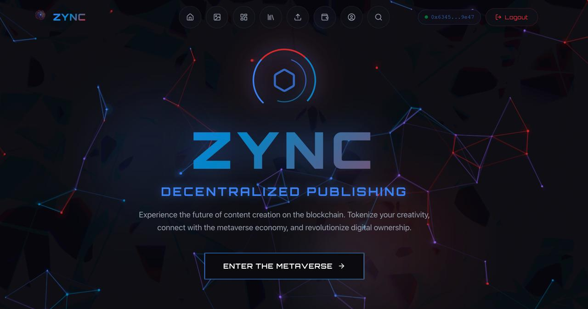

# ZYNC - Decentralized Content Sharing Platform (Stellar)

ZYNC is a decentralized publishing and content-sharing platform built on the **Stellar Blockchain** using **Soroban** smart contracts. The platform empowers creators with decentralized content ownership, fair monetization, and transparent royalty distribution.

## App Interface Preview

### Homepage


### User Dashboard


### Upload Content


### Connect Wallet (Freighter)


### Digital Wallet (XLM)


---

## Features

- **Decentralized Publishing**: Tokenize your content as Soroban NFTs.
- **Fair Monetization**: Direct peer-to-peer payments via Payment Escrows.
- **Automated Royalties**: Transparent secondary sale distributions managed by RoyaltyManager.
- **Access Control**: Role-based permissions (Admin, Creator, Consumer, Moderator).
- **Stellar Integration**: Fast, low-cost transactions on the Stellar Testnet.
- **Freighter Wallet**: Secure authentication using the official Stellar wallet extension.

---

## Technology Stack

- **Blockchain**: Stellar (Soroban Smart Contracts)
- **Contracts Language**: Rust
- **Frontend**: React, TypeScript, Tailwind CSS
- **Backend**: Express.js (Metadata Indexing)
- **Database**: MongoDB (Off-chain metadata)
- **Wallet**: Freighter API

---

## Smart Contracts (Soroban)

| Contract | Contract ID |
|----------|-------------|
| **AccessControl** | `CAUXZFU6GH57S5QWSPO7M2I2ZMWWIX7VA4RFXOA6AT6724D5PTKBZ22A` |
| **ContentNFT** | `CA7VIJCB4D3A7LU2UZHIQDKKCREREBHRT6RLFS35NPT3GKCBMV73WBRW` |
| **RoyaltyManager** | `CBUKJDKA2DSQ4HF5IGAQDUJJ7TLDU3C44ZNA3D7T2IKEFG77T7XMNITS` |
| **PaymentEscrow** | `CC565PKCVD7OODIUP37R3UWRSDVYVPTWAIDKF22D3GNF6WCIYTT4VCGY` |
| **SubscriptionManager** | `CAPJ45XLMHCS75XDYCYJRGTVCXGFZM5FIGP2EBNV7A3C6WTL7COC5HC5` |
| **ContentRegistry** | `CBODPDB5DDR624WR5AFY4ISLYBI5CE3ENFZRZTDAP4FC5M4O6VRX5XKX` |

---

## Getting Started

### Prerequisites

- [Node.js & npm](https://nodejs.org/)
- [Freighter Wallet](https://www.freighter.app/)
- [Rust & Soroban CLI](https://soroban.stellar.org/docs/getting-started/setup)

### Installation

1. **Clone the Repository**
    ```bash
    git clone https://github.com/Anubhab-Rakshit/pitchhackers
    ```
2. **Setup Backend**
    ```bash
    cd backend
    npm install
    cp .env.example .env # Add your MongoDB URI and Stellar Private Key
    npm run dev
    ```
3. **Setup Frontend**
    ```bash
    cd ../frontend
    npm install
    npm run dev
    ```

---

## License

This project is open-source and intended for hackathon or demonstration purposes. For terms, see [LICENSE](LICENSE).
